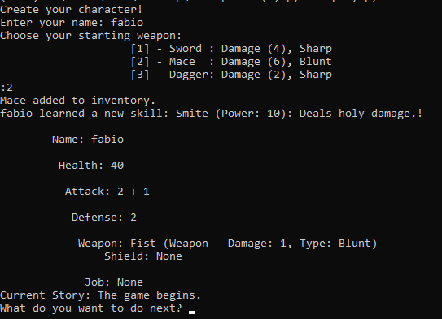
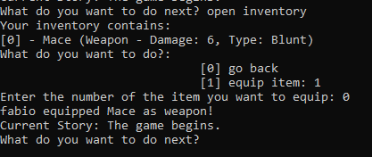
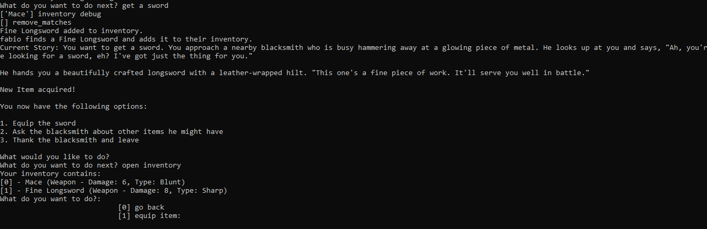
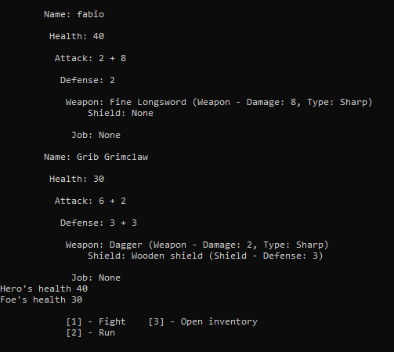

<h1>Text-Based RPG Game</h1>

Welcome to my Text Based Rpg! This project is a work-in-progress interactive and engaging RPG game built with Python and the Groq API, showcasing the potential of AI in generating dynamic game content.

<h2>Table of Contents</h2>
<ul>
    <li><a href="#features">Features</a></li>
    <li><a href="#technologies-used">Technologies Used</a></li>
    <li><a href="#installation">Installation</a></li>
    <li><a href="#usage">Usage</a></li>
    <li><a href="#acknowledgements">Acknowledgements</a></li>
    <li><a href="#license">License</a></li>
</ul>

<h2 id="features">Features</h2>
<ul>
    <li><strong>AI-Generated Content</strong>: Utilizing the Groq API to create rich and varied game narratives.</li>
    <li><strong>Dynamic Health Management</strong>: Implementing health updates based on game events.</li>
    <li><strong>Inventory System</strong>: Automatically managing and updating player inventory.</li>
    <li><strong>Combat System</strong>: Player-driven, providing strategic depth to the game.</li>
</ul>

<h2 id="technologies-used">Technologies Used</h2>
<ul>
    <li><strong>Python</strong>: Core language for game development.</li>
    <li><strong>Groq API</strong>: Leveraging AI for dynamic content generation and storytelling.</li>
    <li><strong>Regular Expressions</strong>: For text processing.</li>
    <li><stong>Langchain</strong>
</ul>

<h2 id="installation">Installation</h2>
<h3>Prerequisites</h3>
<ul>
    <li>Python 3.x</li>
    <li>An API key for the Groq API</li>
</ul>

<h3>Setup</h3>
<ol>
    <li>Clone the repository:
        <pre><code>git clone https://github.com/yourusername/text-based-rpg.git
cd text-based-rpg</code></pre>
    </li>
    <li>Create a virtual environment and activate it:
        <pre><code>python -m venv venv
source venv/bin/activate  # On Windows, use `venv\Scripts\activate`</code></pre>
    </li>
    <li>Install the required packages:
        <pre><code>pip install -r requirements.txt</code></pre>
    </li>
    <li>Set up environment variables for the Groq API key and model name. Create a <code>.env</code> file in the project root with the following content:
        <pre><code>GROQ_API_KEY='your_groq_api_key'
MODEL_NAME='llama3-70b-8192'</code></pre>
    </li>
</ol>

<h2 id="usage">Usage</h2>
<ol>
    <li>Run the game:
        <pre><code>python play.py</code></pre>
    </li>
    <li>Follow the prompts to create your character and interact with the story. You can perform various actions, manage your inventory, and engage in combat.</li>
</ol>

<h2 id="acknowledgements">Acknowledgements</h2>
<ul>
    <li>This project utilizes the <a href="https://groq.com" target="_blank">Groq API</a> for AI-driven content generation.</li>
    <li>Special thanks to the open-source community for the tools and libraries that made this project possible.</li>
</ul>
  
 
 
 
 
